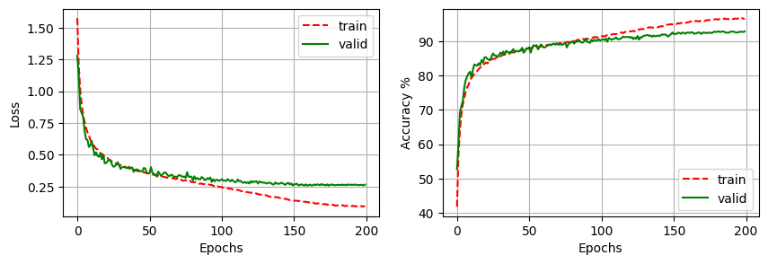

# ResNet Architecture for CIFAR-10 Image Classification

The main task of this mini project is to create a ResNet trained on the CIFAR-10 under a constraint of 5 million parameters ResNet 32 architecture is selected due to its [similar performance](ResNet_Comparison.ipynb) with deeper ResNet while maintaining a smaller parameter size.

 The [initial run](ResNet32_100epoch.ipynb) of the model suggests an overfitting within the model and therefore requires modification in the residual block. The [modified model](model_dropout.py)  with dropout in the residual block manages to [predict](ResNet32_Dropout.ipynb)  with a test accuracy of 92.75%.

